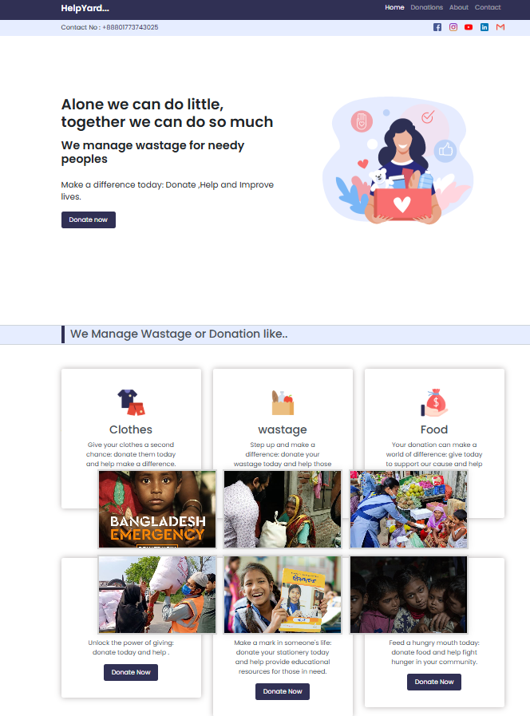

# Donation Management System

A **Donation Management System** is a software application designed to manage and streamline the process of handling donations for non-profit organizations, charities, and fundraising campaigns.

This platform helps organizations efficiently **track donations, manage donors, organize fundraising campaigns, and generate financial reports**. The goal is to improve transparency, reduce manual work, and maintain accurate financial records.
---


## Project Overview

Many charitable organizations still manage donations manually using spreadsheets or paper records. This approach can lead to errors, data loss, and lack of transparency.

The **Donation Management System** solves these problems by providing a centralized digital platform where administrators can monitor donations, manage donor information, and track fundraising campaigns in real time.

---

## Key Features

### Donor Management
- Register and manage donor profiles
- Store donor contact information
- View complete donor history

### Donation Tracking
- Record donations easily
- Track date, amount, and donor
- Maintain secure transaction records

### Campaign Management
- Create and manage fundraising campaigns
- Monitor campaign goals and progress
- View campaign performance statistics

### Admin Dashboard
- Overview of total donations
- Monitor recent activities
- Manage donors and campaigns

### Reporting System
- Generate financial reports
- Track donation trends
- Export reports for accounting purposes

---

## Technology Stack

**Frontend**
- HTML5
- CSS3
- JavaScript
- Bootstrap

**Backend**
- Python (Flask / Django)

**Database**
- MySQL / PostgreSQL / MongoDB

---

## Installation

### 1 Clone the Repository

```bash
git clone https://github.com/khuttes/donation-management-system.git
```


## Project Structure

```
Donation-Management-System
│
├── frontend
│   ├── css
│   ├── js
│   └── html
│
├── backend
│   ├── controllers
│   ├── models
│   └── routes
│
├── database
│   └── schema.sql
│
├── screenshots
│
└── README.md
```

---


## Future Improvements


- Email and SMS donation notifications
- Mobile application version
- Advanced analytics dashboard
- Blockchain-based donation transparency

---

## Contribution

Contributions are welcome.


## License

This project is licensed under the **MIT License**.

---

## Author

**Md. Hasib Islam**

Cybersecurity Enthusiast | Security Tool Developer